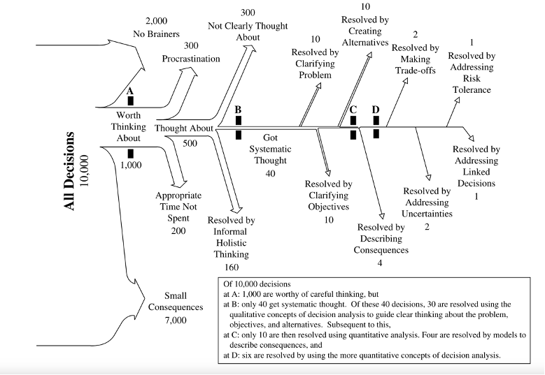

# Review and Synthesis

# Protocol-driven approach to reviewing decision support methods

## Methods

## Literature collection

Protocol: We follow the PRISMA (Preferred Reporting Items for Systematic Reviews and Meta-Analyses) (Figure 2). We gather data from the Web of Science Core Collection curated database of published, peer-reviewed and larger and more diverse published articles, preprints, theses, books, and other relevant scientific content in Google Scholar. After much deliberation and discussion amongst the authors, the final search query consisted of the following keywords.

**Decision + Intervention OR policy + Uncertainty + Expert OR stakeholder + Model OR monte carlo OR simulation OR computer assisted + value of information OR information accuracy**

“decision”+(“intervention”OR”policy”)+“uncertainty”+(“expert”OR”stakeholder”)+(“model“OR”monte carlo”OR”simulation”OR”Bayesian”OR”computer assisted”)+
(“value of information”OR”information accuracy”)

From Web of Science, 14 records were collected in May 2023, and from Google Scholar, 17500+ records were collected in April and May 2023. Associated papers and articles from the search records were also gathered as secondary data collection. Some had shared arXiv or doi links, other parts of shared contributions and assorted affiliations that led to new papers. We applied specific inclusion criteria to this large set of records to reduce the number of records covered under this study. An independent screening of the collected records is performed to confirm their eligibility for the study.

### Inclusion criteria: 

1. Record should be in the English language, 
1. Scientific articles, reports and XXX are included,
1. Must involve some form of decision-making or decision-supporting aspect,

### Reasons for exclusion

- Annual reports, syllabus, catalogs of studies, unrelated legal documents, published bibliography collections, duplicates, course notes, preprints (where we already have the published journal article)
- All non-scientific reports and case studies
- ... 

## Methodology extraction

We use Keeney’s representation of where formal decision support is required and applied as motivation and framework for the assessment - Keeney’s judgment about how 10,000 decisions are typically made - his personal histogram of 10,000 decisions being faced by numerous decision makers \@ref(#fig:01_keeney) [@keeneyMakingBetterDecision2004b].

We followed the Preferred Reporting Items for Systematic Reviews and Meta-Analyses (PRISMA) \@ref(fig:02_prisma) SystematicReviewOverviewFigure 

<!-- temporary note to the co-author team, this figure is editable at this address https://docs.google.com/presentation/d/1TLnVV3VIgcoUeXoBwmzvjdg-08AEW0mhrmnCHfVXQwY/edit#slide=id.p -->

We preserved our search string on searchRxiv [@whitneyReviewMethodsSupporting2023]

*Google Scholar (GS)* yielded 17,600 results but without an asterisk for decision* and model* it yielded just 17,400 results. This is a bit counter intuitive; the ‘*’ should widen rather than narrow the search. If anything, we should expect the opposite effect and the larger return in the former search. Then these 200 additional results would say something like ‘models’ or ‘decisions’ but not ‘model’ or ‘decision’. These should be kept. 

‘Google Scholar advanced search’ is much less targeted (2.4 million hits): 
with all of the words: decision intervention policy uncertainty model
with at least one of the words: “value of information” ”information accuracy” 
“intervention” ”policy”“model*“ 
”monte carlo” ”simulation” ”Bayesian" “computer assisted” 
”expert” ”stakeholder” 
where my words occur ‘anywhere in the article’

After importing papers to Zotero we: 

-	Run PDF search in Zotero to find about 20 missing PDFs. Manual PDF search for ~300. Look up web pages that report findings to find original publication, proceedings (20), papers (40), thesis (30)
-	Remove lots of spurious things that turned up in the results: Annual reports (5+), syllabus / catalogs of studies (10+), unrelated legal documents (3+), published bibliography collections, duplicates (50+), course notes (2), preprints (where we already have the published journal article 5)
-	Add papers to our collection that appear in the bibliography and syllabus that were not already in the search (40+). Google Scholar suggested these papers because of the citation to relevant work. 

In looking for the PDFs and following up with some of the thesis, notes, syllabi etc. in the Google Scholar returned list we added additional associated papers and articles. Some had shared arXiv or doi links, other parts of shared contributions and assorted affiliations that lead to new papers. Sometimes the class notes and syllabus that were in the scholar search return were there because they listed papers that were relevant to our search terms. These were sometimes already in our main collection and sometimes not. When they were not in our collection, we added them.  

Web of Science - 14 results

CABI - 13 results

Decision +
Intervention OR policy +
Uncertainty + 
Expert OR stakeholder +
Model OR "monte carlo" OR simulation OR "computer assisted" + 
"value of information" OR "information accuracy"

