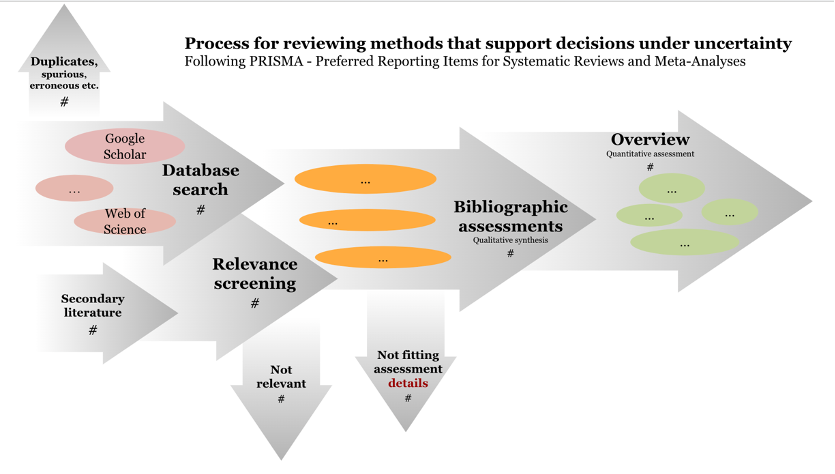

# Review and Synthesis

# Protocol-driven approach to reviewing decision support methods

## Literature collection

We followed the PRISMA (Preferred Reporting Items for Systematic Reviews and Meta-Analyses). We gathered data from the Web of Science Core Collection curated database of published, peer-reviewed and larger and more diverse published articles, preprints, theses, books, and other relevant scientific content in Google Scholar and the Centre for Agriculture and Biosciences International (CABI) Digital Library. The final search query consisted of the following keywords.

*Web of Science* yielded 14 results

**Decision + Intervention OR policy + Uncertainty + Expert OR stakeholder + Model OR monte carlo OR simulation OR computer assisted + value of information OR information accuracy**

*CABI* yielded 13 results

Decision + Intervention OR policy + Uncertainty + Expert OR stakeholder + Model OR "monte carlo" OR simulation OR "computer assisted" + "value of information" OR "information accuracy"

*Google Scholar* yielded 17500+^[17,600 results but without an asterisk for decision* and model* it yielded just 17,400 results. This is a bit counter intuitive; the ‘*’ should widen rather than narrow the search. If anything, we should expect the opposite effect and the larger return in the former search. Then these 200 additional results would say something like ‘models’ or ‘decisions’ but not ‘model’ or ‘decision’. These should be kept.] results 

"decision"+("intervention"OR"policy")+"uncertainty"+("expert"OR"stakeholder")+("model"OR"monte carlo"OR"simulation"OR"Bayesian"OR"computer assisted")+
("value of information"OR"information accuracy")^[‘Google Scholar advanced search’ was much less targeted (2.4 million hits): where any of the words of our search occur anywhere in the article.]

We collected records in April to July 2023. Associated papers and articles from the search records were also gathered as secondary data collection. Some had shared arXiv or doi links, other parts of shared contributions and assorted affiliations that led to new papers. We applied specific inclusion criteria to this large set of records to reduce the number of records covered under this study. An independent screening of the collected records is performed to confirm their eligibility for the study.

### Inclusion criteria: 

1. Record should be in the English language, 
1. Scientific articles, reports and others are included,
1. Must involve some form of decision-making or decision-supporting aspect,

### Reasons for exclusion

- Annual reports, syllabus, catalogs of studies, unrelated legal documents, published bibliography collections, duplicates, course notes, preprints (where we already have the published journal article)
- All non-scientific reports and case studies



We followed the Preferred Reporting Items for Systematic Reviews and Meta-Analyses (PRISMA) \@ref(fig:02_prisma) SystematicReviewOverviewFigure 

<!-- temporary note to the co-author team, this figure is editable at this address https://docs.google.com/presentation/d/1TLnVV3VIgcoUeXoBwmzvjdg-08AEW0mhrmnCHfVXQwY/edit#slide=id.p -->

We preserved our search string on searchRxiv [@whitneyReviewMethodsSupporting2023]

After importing papers to Zotero we: 

-	Ran a native PDF search in Zotero to find missing PDFs.
- Did a manual PDF search for ~1000 ^[Look up web pages that report findings to find original publication, proceedings (200), papers (400), thesis (300)]
-	Remove spurious work that turned up in the results: Annual reports (50+), syllabus / catalogs of studies (100+), unrelated legal documents (30+), published bibliography collections, duplicates (50+), course notes (20), preprints (where we already have the published journal article 50)
-	Add papers to our collection that appear in the bibliography and syllabus that were not already in the search (400+).  
- Formatted meta-data for all references with Linter https://github.com/northword/zotero-format-metadata
- All manual classification were used to inform automation functions

In looking for the PDFs and following up with some of the thesis, notes, syllabi etc. in the list we added additional associated papers and articles. Some had shared arXiv or doi links, other parts of shared contributions and assorted affiliations that lead to new papers. Sometimes the class notes and syllabus that were in the scholar search return were there because they listed papers that were relevant to our search terms. These were sometimes already in our main collection and sometimes not. When they were not in our collection, we added them. 

## Data Import and Preprocessing

### Bibliographic Data

Import bibliographic records using the `bib2df` and `qs` package [@R-bib2df' @R-qs], converting our BibTeX file into a structured data frame for systematic processing.

```{r read_data, echo=TRUE}
# Read the bib file
library(bib2df)
library(qs) 

bib_file <- "bib/23_Methods_Review_Holistic_Systems.bib"
# Run if any changes to bib_file (takes a long time, several hours)
# bib_data <- bib2df::bib2df(bib_file)
# qs::qsave(bib_data, cache_file)
cache_file <- "bib/bib_data_cache.qs"

if (file.exists(cache_file)) {
  bib_data <- qs::qread(cache_file)
  cat("Loaded from qs cache\n")
} else {
  bib_data <- bib2df::bib2df(bib_file)
  qs::qsave(bib_data, cache_file)
  cat("Created qs cache\n")
}

```

Our BibTeX contains (n = `r nrow(bib_data)`) citations.

### BibTeX Cleaning

We prepare the BibTeX file using `dplyr` [@R-dplyr], for annotation tracking and text consolidation.

```{r clean_data, echo=TRUE}
# Basic cleaning and text preparation
clean_bib_data <- bib_data %>%
  dplyr::mutate(
    has_annotation = !is.na(ANNOTE) & ANNOTE != "",
    annotation_text = ifelse(has_annotation, ANNOTE, ""),
    full_text = paste(TITLE, ANNOTE, sep = " "),
    year = as.numeric(YEAR)
  )
```

`r sum(clean_bib_data$has_annotation)` of the citations have annotations.

Use dplyr `count` [@R-dplyr] and knitr `kable` [@R-knitr] for a clean bib file. 

```{r clean_bib_data}
# Apply manual classifications from Zotero keywords
source("R/classify_papers.R")
clean_bib_data <- classify_papers(clean_bib_data)

# Summary of manual classifications
manual_summary <- clean_bib_data %>%
  dplyr::count(manual_classification, manual_reason)

knitr::kable(manual_summary, caption = "Manual Classification Summary")
```

Verify the manual review steps with automated exclusion rules using the `apply_exclusion_rules` function. The function uses `dplyr` for data manipulation with `case_when` and `mutate` [@R-dplyr], the `magrittr` pipe operator `%>%` [@R-magrittr], and `stringr` for pattern matching with `str_detect` [@R-stringr]. The rules implement our PRISMA exclusion criteria by detecting inappropriate document types, non-English content, and clearly irrelevant papers through text pattern matching in titles and metadata.

```{r apply_exclusion_rules}
source("R/apply_exclusion_rules.R")
# Apply exclusion rules
clean_bib_data <- apply_exclusion_rules(clean_bib_data)
```

The cleaned bib file contains (n = `r nrow(clean_bib_data)`) citations.

## Run PRISMA Pipeline

Define PRISMA exclusion criteria in the `prisma_config` function, using base R [@R-base] to create organized lists of exclusion patterns for duplicates, document types, languages, and irrelevant content. 

```{r prisma_config}
 source("R/prisma_config.R")
```

Detect duplicates with `identify_duplicates`, using `dplyr` [@R-dplyr] and base R duplicate detection [@R-base] to find both title-based and DOI-based duplicates through text normalization and exact matching.

```{r identify_duplicates}
 source("R/identify_duplicates.R")
```

Apply manual classifications from bib keywords using `apply_manual_classifications`, with `dplyr` [@R-dplyr] and `stringr` [@R-stringr] to identify papers that we manually marked 'bin' for exclusion or 'read' for inclusion.

```{r apply_manual_classifications}
  source("R/apply_manual_classifications.R") 
```

Apply final classification decisions using `apply_final_classification`, with `dplyr` [@R-dplyr] to prioritize manual classifications over automated rules and resolve paper inclusion status.

```{r apply_final_classification}
   source("R/apply_final_classification.R")
```

Generate PRISMA flow statistics using `generate_prisma_stats`, with `dplyr` [@R-dplyr] to calculate counts and percentages for each exclusion and inclusion category.

```{r generate_prisma_stats}
   source("R/generate_prisma_stats.R")
```

Export PRISMA results using `export_prisma_results`, with `bib2df` [@R-bib2df] to create separate BibTeX files for included and excluded papers.

```{r export_prisma_results}
  source("R/export_prisma_results.R")
```

Generate PRISMA flow output using `generate_prisma_flow_output`, with base R [@R-base] to format statistics for the systematic review flow diagram.

```{r generate_prisma_flow_output}
   source("R/generate_prisma_flow_output.R")
```

Execute the complete PRISMA pipeline using `run_prisma_pipeline`, orchestrating all classification, exclusion, and export steps to generate final systematic review results.

```{r run_prisma_pipeline}
source("R/run_prisma_pipeline.R")

# Run the complete PRISMA pipeline
prisma_results <- run_prisma_pipeline(clean_bib_data)

# The result is a list, so extract the actual data
prisma_filtered_data <- prisma_results$classified_data

# Check if filtering worked
cat("Original records:", nrow(clean_bib_data), "\n")
cat("After PRISMA filtering:", nrow(prisma_filtered_data), "\n")

# Access results
prisma_results$statistics
prisma_results$export_files$included_count

clean_bib_data_prisma <- prisma_results$classified_data
```

Validate manual classification accuracy using `validate_manual_decisions`, with `dplyr` [@R-dplyr] to verify that 'bin' papers are excluded and 'read' papers are included as intended.

```{r validate_manual_decisions, echo=FALSE}
source("R/validate_manual_decisions.R")

# Step 1: Run all classification steps first
clean_bib_data_prisma <- identify_duplicates(clean_bib_data_prisma)
clean_bib_data_prisma <- apply_manual_classifications(clean_bib_data_prisma)
clean_bib_data_prisma <- apply_exclusion_rules(clean_bib_data_prisma)
clean_bib_data_prisma <- apply_final_classification(clean_bib_data_prisma)  # This creates final_decision

# Step 2: Now run validation (final_decision exists now)
validation_results <- validate_manual_decisions(clean_bib_data_prisma)

if(validation_results$read_papers_incorrectly_excluded == 0 & 
   validation_results$bin_papers_incorrectly_included == 0) {
  cat("Validation PASSED: All manual classifications respected\n")
  cat("   -", validation_results$read_papers_total, "read papers correctly included\n")
} else {
  cat("Validation FAILED: Manual classification errors detected\n")
}

```

