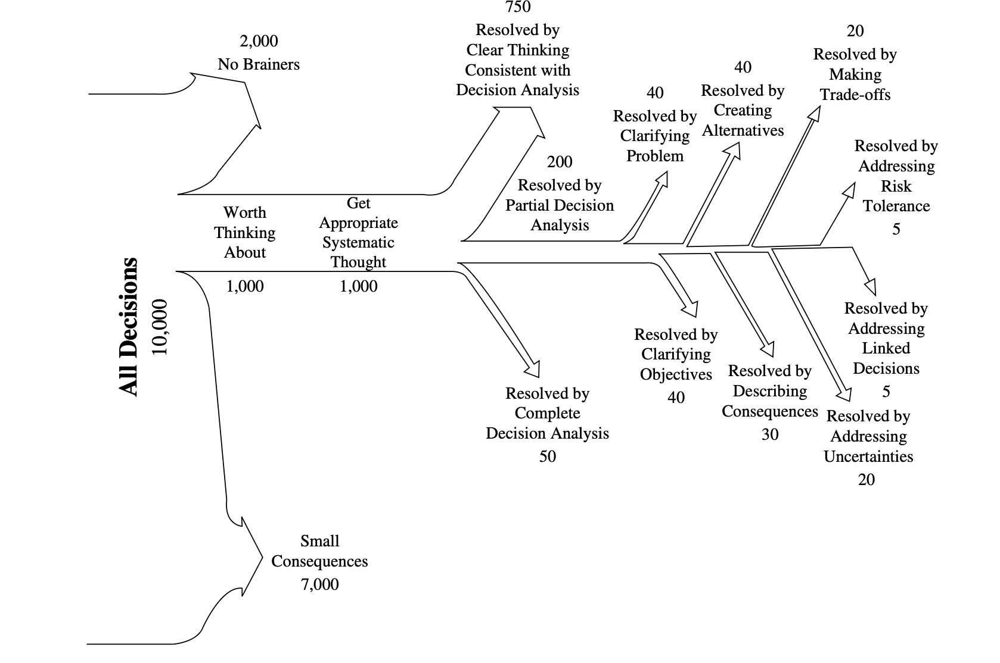

```{r knitr_setup, include=FALSE, message=FALSE, warning=FALSE}

# Global knitr options
knitr::opts_chunk$set(
  echo = TRUE,           # Show code in output
  eval = TRUE,           # Evaluate code chunks
  include = TRUE,        # Include chunk output
  message = FALSE,       # Suppress package messages
  warning = FALSE,       # Suppress warnings
  error = FALSE,         # Continue on errors (set to TRUE for debugging)
  cache = TRUE,          # Cache results for faster knitting
  cache.lazy = FALSE,    # Eager caching for large datasets
  fig.width = 10,        # Figure width in inches
  fig.height = 6,        # Figure height in inches
  fig.align = "center",  # Figure alignment
  fig.pos = "H",         # Figure position
  out.width = "90%",     # Output width
  fig.cap = TRUE,        # Enable figure captions
  dev = "png",           # Graphics device
  dpi = 300,             # Figure resolution
  tidy = FALSE,          # Don't tidy code (preserve formatting)
  results = "markup"     # How to display results
)


# Load required packages quietly
suppressPackageStartupMessages({
  library(bib2df)        # BibTeX file processing
  library(dplyr)         # Data manipulation
  library(tidyr)         # Data tidying
  library(stringr)       # String operations
  library(purrr)         # Functional programming
  library(ggplot2)       # Data visualization
  library(scales)        # Plot scales
  library(kableExtra)    # Enhanced tables
  library(knitr)
  library(magrittr)
  library(DT)            # Interactive tables
  library(networkD3)
  library(tidytext)
  library(ggthemes)      # Additional ggplot themes
})

# Generate bibliography for all used packages
packages_to_cite <- c("base", 
                      "bib2df", 
                      "dplyr", 
                      "tidyr", 
                      "stringr", 
                      "purrr", 
                      "ggplot2", 
                     "knitr", 
                     "magrittr",
                     "bookdown", 
                     "tidytext",
                     "networkD3",
                     "DT")
knitr::write_bib(packages_to_cite, "bib/packages.bib")

# Set ggplot theme for consistent styling
theme_set(theme_minimal(base_size = 12, base_family = "sans"))
theme_update(
  plot.title = element_text(face = "bold", size = 16, hjust = 0.5),
  plot.subtitle = element_text(face = "italic", size = 12, hjust = 0.5),
  axis.title = element_text(face = "bold", size = 12),
  legend.title = element_text(face = "bold"),
  panel.grid.minor = element_blank(),
  plot.caption = element_text(face = "italic", size = 10)
)

# Custom color palette for methods
method_colors <- c(
  bayesian = "#1f77b4",
  simulation = "#ff7f0e", 
  optimization = "#2ca02c",
  statistical = "#d62728",
  decision_analysis = "#9467bd",
  machine_learning = "#8c564b",
  multi_criteria = "#e377c2",
  economic_evaluation = "#7f7f7f",
  risk_analysis = "#bcbd22",
  forecasting = "#17becf"
)

```

```{r child="01_Introduction.Rmd"}
```

```{r child="02_Review.Rmd"}
```

# Data Import and Preprocessing

## Bibliographic Data

Import bibliographic records using the `bib2df` package [@R-bib2df], converting our BibTeX file into a structured data frame for systematic processing.

```{r read_data, echo=TRUE}
# Read the bib file
bib_data <- bib2df::bib2df("bib/23_Methods_Review_Holistic_Systems.bib")
```

Our BibTeX contains (n = `r nrow(bib_data)`) citations.

## BibTeX Cleaning

We prepare the BibTeX file using `dplyr` [@R-dplyr], for annotation tracking and text consolidation.

```{r clean_data, echo=TRUE}
# Basic cleaning and text preparation
clean_bib_data <- bib_data %>%
  dplyr::mutate(
    has_annotation = !is.na(ANNOTE) & ANNOTE != "",
    annotation_text = ifelse(has_annotation, ANNOTE, ""),
    full_text = paste(TITLE, ANNOTE, sep = " "),
    year = as.numeric(YEAR)
  )
```

`r sum(clean_bib_data$has_annotation)` of the citations have annotations.

Use dplyr `count` [@R-dplyr] and knitr `kable` [@R-knitr] for a clean bib file. 

```{r clean_bib_data}
# Apply manual classifications from Zotero keywords
source("R/classify_papers.R")
clean_bib_data <- classify_papers(clean_bib_data)

# Summary of manual classifications
manual_summary <- clean_bib_data %>%
  dplyr::count(manual_classification, manual_reason)

knitr::kable(manual_summary, caption = "Manual Classification Summary")
```

Verify the manual review steps with automated exclusion rules using the `apply_exclusion_rules` function. The function uses `dplyr` for data manipulation with `case_when` and `mutate` [@R-dplyr], the `magrittr` pipe operator `%>%` [@R-magrittr], and `stringr` for pattern matching with `str_detect` [@R-stringr]. The rules implement our PRISMA exclusion criteria by detecting inappropriate document types, non-English content, and clearly irrelevant papers through text pattern matching in titles and metadata.

```{r apply_exclusion_rules}
source("R/apply_exclusion_rules.R")
# Apply exclusion rules
clean_bib_data <- apply_exclusion_rules(clean_bib_data)
```

The cleaned bib file contains (n = `r nrow(bib_data)`) citations.

## Run PRISMA Pipeline

Define PRISMA exclusion criteria in the `prisma_config` function, using base R [@R-base] to create organized lists of exclusion patterns for duplicates, document types, languages, and irrelevant content. 

```{r prisma_config}
 source("R/prisma_config.R")
```

Detect duplicates with `identify_duplicates`, using `dplyr` [@R-dplyr] and base R duplicate detection [@R-base] to find both title-based and DOI-based duplicates through text normalization and exact matching.

```{r identify_duplicates}
 source("R/identify_duplicates.R")
```

Apply manual classifications from bib keywords using `apply_manual_classifications`, with `dplyr` [@R-dplyr] and `stringr` [@R-stringr] to identify papers that we manually marked 'bin' for exclusion or 'read' for inclusion.

```{r apply_manual_classifications}
  source("R/apply_manual_classifications.R") 
```

Apply final classification decisions using `apply_final_classification`, with `dplyr` [@R-dplyr] to prioritize manual classifications over automated rules and resolve paper inclusion status.

```{r apply_final_classification}
   source("R/apply_final_classification.R")
```

Generate PRISMA flow statistics using `generate_prisma_stats`, with `dplyr` [@R-dplyr] to calculate counts and percentages for each exclusion and inclusion category.

```{r generate_prisma_stats}
   source("R/generate_prisma_stats.R")
```

Export PRISMA results using `export_prisma_results`, with `bib2df` [@R-bib2df] to create separate BibTeX files for included and excluded papers.

```{r export_results}
  source("R/export_results.R")
```

Generate PRISMA flow output using `generate_prisma_flow_output`, with base R [@R-base] to format statistics for the systematic review flow diagram.

```{r generate_prisma_flow_output}
   source("R/generate_prisma_flow_output.R")
```

Execute the complete PRISMA pipeline using `run_prisma_pipeline`, orchestrating all classification, exclusion, and export steps to generate final systematic review results.

```{r run_prisma_pipeline}
source("R/run_prisma_pipeline.R")

# Run the complete PRISMA pipeline
prisma_results <- run_prisma_pipeline(clean_bib_data)

# Access results
prisma_results$statistics
prisma_results$export_files$included_count
prisma_results$export_files$excluded_count
```

Validate manual classification accuracy using `validate_manual_decisions`, with `dplyr` [@R-dplyr] to verify that 'bin' papers are excluded and 'read' papers are included as intended.

```{r validate_manual_decisions, echo=FALSE}
source("R/validate_manual_decisions.R")

# Step 1: Run all classification steps first
clean_bib_data <- identify_duplicates(clean_bib_data)
clean_bib_data <- apply_manual_classifications(clean_bib_data)
clean_bib_data <- apply_exclusion_rules(clean_bib_data)
clean_bib_data <- apply_final_classification(clean_bib_data)  # This creates final_decision

# Step 2: Now run validation (final_decision exists now)
validation_results <- validate_manual_decisions(clean_bib_data)


if(validation_results$read_papers_incorrectly_excluded == 0 & 
   validation_results$bin_papers_incorrectly_included == 0) {
  cat("✅ Validation PASSED: All manual classifications respected\n")
  cat("   -", validation_results$read_papers_total, "read papers correctly included\n")
  cat("   -", validation_results$bin_papers_total, "bin papers correctly excluded\n")
} else {
  cat("❌ Validation FAILED: Manual classification errors detected\n")
}

```

Our automated procedures excluded several additional papers

- Non-scientific articles and reports (`r prisma_results$step_counts$excluded_non_scientific` excluded)
- Inappropriate document types: annual reports, syllabus, course notes (`r prisma_results$step_counts$excluded_doc_type` excluded),
- Duplicates (`r prisma_results$step_counts$duplicates_removed` removed),
- Preprints when published versions were available (`r prisma_results$step_counts$excluded_preprint` excluded),
- Manually marked for exclusion during preliminary screening (`r prisma_results$step_counts$manually_excluded` excluded)

**Note:** We did not exclude based on content relevance to ensure comprehensive method coverage, resulting in `r prisma_results$step_counts$final_included` papers for analysis.

# Method Extraction and Synthesis

We use Keeney’s representation of where formal decision support is required and applied as motivation and framework for the assessment - Keeney’s judgment about how 10,000 decisions are typically made - his personal histogram of 10,000 decisions being faced by numerous decision makers [@keeneyMakingBetterDecision2004b].

{width=50%}

## Method Term Discovery

Search the bibliographic record for method terms from titles, abstracts, keywords, and annotations.

```{r method_discovery_comprehensive, echo=TRUE}

# Combine all text fields for comprehensive analysis
all_text_data <- clean_bib_data %>%
  mutate(
    combined_text = paste(
      TITLE, 
      ifelse(!is.na(ABSTRACT), ABSTRACT, ""),
      ifelse(!is.na(KEYWORDS), KEYWORDS, ""),
      ifelse(!is.na(ANNOTE), ANNOTE, ""),
      sep = " "
    )
  )

# Tokenize all text fields to discover method terms
method_terms_comprehensive <- all_text_data %>%
  select(combined_text) %>%
  unnest_tokens(word, combined_text) %>%
  count(word, sort = TRUE) %>%
  filter(n > 5, nchar(word) > 3) %>%  # Filter for meaningful terms
  anti_join(stop_words)  # Remove common stop words
```

```{r display_method_terms, echo=FALSE}
knitr::kable(
  method_terms_comprehensive %>% head(30),
  caption = "Top 30 Most Frequent Terms Across All Text Fields",
  col.names = c("Term", "Frequency")
)
```


<!-- ```{r bigram_analysis, echo=TRUE} -->
<!-- # Analyze multi-word method terms using n-grams -->
<!-- method_bigrams_comprehensive <- all_text_data %>% -->
<!--   select(combined_text) %>% -->
<!--   unnest_tokens(bigram, combined_text, token = "ngrams", n = 2) %>% -->
<!--   count(bigram, sort = TRUE) %>% -->
<!--   filter(n > 2)  # Keep only terms appearing multiple times -->
<!-- ``` -->


<!-- ```{r display_bigrams, echo=FALSE} -->
<!-- knitr::kable( -->
<!--   method_bigrams_comprehensive %>% head(20), -->
<!--   caption = "Top 20 Most Frequent Bigrams (Two-Word Terms)", -->
<!--   col.names = c("Bigram", "Frequency") -->
<!-- ) -->
<!-- ``` -->


```{r method_pattern_analysis, echo=TRUE}
# Use pattern matching to find potential method terms in context
method_patterns <- c(
  "analysis", "model", "method", "approach", "framework", 
  "technique", "algorithm", "estimation", "evaluation", "simulation",
  "optimization", "bayesian", "statistical", "stochastic"
)

# Extract sentences containing method terms
method_sentences <- all_text_data %>%
  select(combined_text) %>%
  unnest_tokens(sentence, combined_text, token = "sentences") %>%
  filter(str_detect(tolower(sentence), paste(method_patterns, collapse = "|"))) %>%
  sample_n(10)  # Sample for review
```

## Sample Sentences Containing Method Terms

```{r display_method_context, echo=FALSE}
knitr::kable(
  data.frame(Example_Sentences = method_sentences$sentence)
)
```

```{r keyword_analysis, echo=TRUE}
# Specifically analyze author-provided keywords
if("KEYWORDS" %in% names(clean_bib_data)) {
  keyword_analysis <- clean_bib_data %>%
    filter(!is.na(KEYWORDS)) %>%
    select(KEYWORDS) %>%
    unnest_tokens(keyword, KEYWORDS, token = "regex", pattern = ";|,") %>%
    mutate(keyword = str_trim(tolower(keyword))) %>%
    count(keyword, sort = TRUE) %>%
    filter(n > 1, nchar(keyword) > 2)
}
```

```{r display_keywords, echo=FALSE}
if(exists("keyword_analysis")) {
  knitr::kable(
    keyword_analysis %>% head(20),
    caption = "Top 20 Author-Provided Keywords",
    col.names = c("Keyword", "Frequency")
  )
}
```

```{r method_categories}
# method categories
method_categories <- list(
  bayesian = c("bayesian", "bayes", "mcmc", "markov chain", "prior", "posterior"),
  simulation = c("simulation", "monte carlo", "stochastic", "agent-based", "discrete event"),
  optimization = c("optimization", "linear programming", "nonlinear programming", "heuristic"),
  statistical = c("regression", "anova", "time series", "survival analysis", "mixed model"),
  decision_analysis = c("decision analysis", "decision tree", "markov model", "value of information", "voi"),
  machine_learning = c("machine learning", "neural network", "random forest", "svm", "clustering"),
  multi_criteria = c("multi-criteria", "multi criteria", "analytic hierarchy", "ahp", "topsis"),
  economic_evaluation = c("cost-effectiveness", "cost-benefit", "cost-utility", "economic evaluation"),
  risk_analysis = c("risk analysis", "risk assessment", "sensitivity analysis", "uncertainty analysis")
)
```


##################

```{r}
# Ensure method detection has been run
if(!"detected_methods" %in% names(clean_bib_data)) {
  source("R/detect_methods.R")
  clean_bib_data <- clean_bib_data %>%
    mutate(
      detected_methods = map_chr(full_text, detect_methods)
    )
}
```

# Create qualitative data

```{r}
# Create qualitative data with only existing columns
qualitative_data <- clean_bib_data %>%
  filter(final_decision == "include") %>%  # Only included papers
  mutate(
    # Combine all relevant text fields that exist
    full_content = paste(
      ifelse(!is.na(TITLE), paste("TITLE:", TITLE), ""),
      ifelse("ABSTRACT" %in% names(.) & !is.na(ABSTRACT), paste("ABSTRACT:", ABSTRACT), ""),
      ifelse("KEYWORDS" %in% names(.) & !is.na(KEYWORDS), paste("KEYWORDS:", KEYWORDS), ""),
      ifelse("ANNOTE" %in% names(.) & !is.na(ANNOTE), paste("ANNOTATION:", ANNOTE), ""),
      sep = "\n\n"
    )
  ) %>%
  select(BIBTEXKEY, TITLE, full_content)

# Extract method content from available text
method_sentences_comprehensive <- qualitative_data %>%
  unnest_tokens(sentence, full_content, token = "sentences") %>%
  filter(str_detect(tolower(sentence), 
                   "method|approach|technique|model|framework|analysis|algorithm")) %>%
  mutate(
    sentence_length = nchar(sentence),
    # Categorize by method focus
    method_focus = case_when(
      str_detect(tolower(sentence), "bayesian|prior|posterior") ~ "Bayesian",
      str_detect(tolower(sentence), "simulation|monte carlo|stochastic") ~ "Simulation",
      str_detect(tolower(sentence), "optimization|linear programming") ~ "Optimization",
      str_detect(tolower(sentence), "decision.*tree|value.*information") ~ "Decision Analysis",
      str_detect(tolower(sentence), "machine learning|neural network") ~ "Machine Learning",
      TRUE ~ "General Methodology"
    )
  )
```

# Summary of methods

```{r}
# Summary of method themes
method_themes <- method_sentences_comprehensive %>%
  count(method_focus, sort = TRUE) %>%
  mutate(percentage = n / n() * 100)

knitr::kable(method_themes, 
             caption = "Bibliographic Assessment: method Themes in Literature",
             col.names = c("method Focus", "Count", "Percentage"))
```

# Generate synthesis insights

```{r}
# Generate synthesis insights from our PRISMA results
synthesis_insights <- list(
  total_papers_analyzed = prisma_results$step_counts$final_included,
  papers_for_qualitative = prisma_results$statistics$included$qualitative_synthesis,
  papers_for_quantitative = prisma_results$statistics$included$quantitative_assessment,
  method_sentences = nrow(method_sentences_comprehensive),
  dominant_methods = method_themes %>% head(3) %>% pull(method_focus)
)

# Display synthesis summary
cat("## Qualitative Synthesis: Bibliographic Assessment\n\n")
cat("**Quantitative Analysis:**", synthesis_insights$papers_for_quantitative, "papers\n")
cat("**Qualitative Synthesis:**", synthesis_insights$papers_for_qualitative, "manually reviewed papers\n")
cat("**method Content:**", synthesis_insights$method_sentences, "sentences describing methods\n")
cat("**Dominant method Themes:**", paste(synthesis_insights$dominant_methods, collapse = ", "), "\n")

```
# Show method descriptions

```{r}
# Show rich method descriptions
rich_method_descriptions <- method_sentences_comprehensive %>%
  filter(sentence_length > 50 & sentence_length < 300) %>%
  filter(!str_detect(tolower(sentence), "abstract|keyword|title")) %>%
  group_by(method_focus) %>%
  sample_n(min(2, n())) %>%
  ungroup() %>%
  select(Method_Type = method_focus, Description = sentence)

knitr::kable(rich_method_descriptions,
             caption = "Qualitative Synthesis: method Context Examples")
```

```{r}
# Export as CSV with BibTeX references for easy analysis
export_qualitative_csv <- function(method_sentences, output_file = "data/qualitative_synthesis.csv") {
  
  # Create export data frame
  export_data <- method_sentences %>%
    mutate(
      bib_reference = paste("[@", BIBTEXKEY, "]", sep = ""),
      full_sentence_with_ref = paste(sentence, bib_reference)
    ) %>%
    select(BIBTEXKEY, TITLE, method_focus, sentence_length, 
           full_sentence_with_ref, sentence, bib_reference)
  
  write.csv(export_data, output_file, row.names = FALSE)
  cat("Qualitative data with references exported to:", output_file, "\n")
  return(export_data)
}

# Run CSV export
csv_export <- export_qualitative_csv(method_sentences_comprehensive)
```

```{r}
```

#################
#################
#################
#################

# Automated Method Detection

Apply automated classification using a custom dictionary-based algorithm `detect_methods.R` identifying methods from text content with `purrr` package [@R-purrr]. Methods appearing in titles receive higher reliability weights for subsequent analysis.

```{r detect_methods}
source("R/detect_methods.R")
# Apply method detection
clean_bib_data <- clean_bib_data %>%
  mutate(
    detected_methods = map_chr(full_text, detect_methods),
    methods_from_title = map_chr(TITLE, detect_methods)
  )
```

<!-- ## Method Detection Validation -->

<!-- Validate the automated classification with metrics including detection rates and confidence level distribution.  -->

<!-- ```{r method_detection_check_clean, echo=FALSE} -->
<!-- # Create a clean summary table -->
<!-- detection_summary <- data.frame( -->
<!--   Metric = c("Total papers",  -->
<!--              "Papers with methods detected",  -->
<!--              "Papers with VOI", -->
<!--              "High confidence classifications", -->
<!--              "Medium confidence classifications", -->
<!--              "Low confidence classifications"), -->
<!--   Count = c(nrow(clean_bib_data), -->
<!--             sum(clean_bib_data$detected_methods != ""), -->
<!--             sum(clean_bib_data$has_voi), -->
<!--             sum(clean_bib_data$method_confidence == "high"), -->
<!--             sum(clean_bib_data$method_confidence == "medium"),  -->
<!--             sum(clean_bib_data$method_confidence == "low")) -->
<!-- ) -->

<!-- knitr::kable(detection_summary,  -->
<!--              caption = "Method Detection Summary Statistics", -->
<!--              col.names = c("Metric", "Count")) -->
<!-- ``` -->

<!-- ## Classification Examples -->

<!-- We display representative examples of automated method classifications to illustrate detection accuracy and confidence assignment.  -->

<!-- ```{r sample_results} -->
<!-- # Show some examples -->
<!-- sample_results <- clean_bib_data %>% -->
<!--   filter(detected_methods != "") %>% -->
<!--   select(TITLE, detected_methods, method_confidence) %>% -->
<!--   head(10) -->

<!-- print(sample_results) -->
<!-- ``` -->

## Method Frequency Analysis

Quantify and visualize the distribution of methods in the bib using frequency and bar chart from `ggplot2` [@R-ggplot2].

```{r method_results_plot}
source("R/analyze_method_frequency.R")

method_results <- analyze_method_frequency(clean_bib_data)
print(method_results$plot)
print(method_results$counts)
```

The `method_results` reveal both dominant and less common approaches.

## Papers Summary

Summarize all papers with `summarise` from [@R-dplyr] and print with `knitr` [@R-knitr]. 

```{r summary_report}
source("R/add_confidence_scores.R")
# Create summary report
summary_stats <- clean_bib_data %>%
  summarise(
    total_papers = n(),
    papers_with_methods = sum(detected_methods != ""),
    high_confidence = sum(method_confidence == "high")
  )

knitr::kable(summary_stats, caption = "Summary of papers")
```

## Dominant Methods

Count prevalent methods using `count` for frequency analysis and `tidyr` [@R-tidyr] for data restructuring.

```{r top_methods}
# Show top methods
top_methods <- clean_bib_data %>%
  filter(detected_methods != "") %>%
  separate_rows(detected_methods, sep = "; ") %>%
  count(detected_methods, sort = TRUE) %>%
  head(10)

print(top_methods)
```

`top_methods` reveals the method ecosystem's core components, highlighting established practices and potential gaps in decision support under uncertainty literature.

## VOI Method Validation

Examine Value of Information (VOI) papers specifically to assess classification plausibility and confidence distribution within this focused method domain.

```{r validation_check}
# Quick validation - check if our detection makes sense
validation_check <- clean_bib_data %>%
  filter(has_voi) %>%
  select(TITLE, detected_methods, method_confidence) %>%
  arrange(desc(method_confidence))

print(validation_check)
```

`validation_check` ensures classification accuracy.

# High-Reliability Classifications

Examine the subset of classifications receiving the highest confidence rating, where methods were detected in both titles and full text.

```{r high_confidence}
# Check papers with high confidence
high_confidence <- clean_bib_data %>%
  filter(method_confidence == "high") %>%
  select(TITLE, detected_methods, methods_from_title)

print(high_confidence)
```

## Hierarchy of decision intensity

Keeney's concept of a "hierarchy of decision intensity" mapped to method sophistication in the literature.

```{r keeney_intensity}
source("R/detect_application_domains.R")
source("R/define_keeney_intensity.R")
source("R/classify_decision_intensity.R")
source("R/analyze_keeney_pattern.R")
source("R/run_keeney_analysis.R")

# Ensure all required data is present
clean_bib_data <- clean_bib_data %>%
  mutate(
    full_text = paste(TITLE, ANNOTE, sep = " ")
  )

# Run the complete analysis
keeney_results <- run_keeney_analysis(clean_bib_data)

# Display results
knitr::kable(keeney_results$intensity_stats, 
             caption = "Distribution of Decision Intensity Levels")


```

Plot with `networkD3` [@R-networkD3]. 

## Testing Keeney's Hierarchy of Decision Intensity

Following Keeney's insight that most decisions are "no-brainers" while few require deep analytical support [@keeneyMakingBetterDecision2004b], we classified method approaches in our literature by decision intensity:

- **Level 1**: Intuitive decisions (heuristics, rules of thumb)
- **Level 2**: Simple analysis (basic tools, checklists)  
- **Level 3**: Structured analysis (systematic frameworks)
- **Level 4**: Advanced analysis (stochastic, optimization)
- **Level 5**: Deep uncertainty methods (robust decision making)

Our analysis reveals that `r sum(keeney_results$intensity_stats$keeney_prediction == "High frequency")`% of method applications address lower-intensity decisions, supporting Keeney's observation that sophisticated methods are reserved for particularly complex decision contexts.

```{r sankey_intensity}

# 1. First, classify the intensity levels
source("R/classify_decision_intensity.R")
clean_bib_data <- classify_decision_intensity(clean_bib_data)

# Count papers by method and intensity level
method_level_counts <- clean_bib_data %>%
  filter(detected_methods != "" & primary_intensity != "Unclassified") %>%
  separate_rows(detected_methods, sep = "; ") %>%
  count(detected_methods, primary_intensity) %>%
  mutate(
    intensity_num = case_when(
      primary_intensity == "Level 1: Intuitive Decisions" ~ 1,
      primary_intensity == "Level 2: Simple Analysis" ~ 2,
      primary_intensity == "Level 3: Structured Analysis" ~ 3,
      primary_intensity == "Level 4: Advanced Analysis" ~ 4,
      primary_intensity == "Level 5: Deep Uncertainty" ~ 5
    )
  ) %>%
  arrange(intensity_num, detected_methods)

# Create nodes for methods and levels
method_nodes <- unique(method_level_counts$detected_methods)
level_nodes <- c("Level 1", "Level 2", "Level 3", "Level 4", "Level 5")

nodes <- data.frame(
  name = c(method_nodes, level_nodes),
  node_group = c(rep("method", length(method_nodes)), rep("level", length(level_nodes)))
)

```

```{r plot_sankey}
source("R/plot_sankey.R")

# Get our intensity level counts
level_counts <- clean_bib_data %>%
  filter(primary_intensity != "Unclassified") %>%
  count(primary_intensity) %>%
  mutate(
    level_num = case_when(
      primary_intensity == "Level 1: Intuitive Decisions" ~ 1,
      primary_intensity == "Level 2: Simple Analysis" ~ 2,
      primary_intensity == "Level 3: Structured Analysis" ~ 3,
      primary_intensity == "Level 4: Advanced Analysis" ~ 4,
      primary_intensity == "Level 5: Deep Uncertainty" ~ 5
    )
  ) %>%
  arrange(level_num)

# Prepare data in the EXACT same structure as the working example
total_papers <- sum(level_counts$n)

# Inputs: Total papers 
inputs = c(
  total_papers,  # All papers 
  0              # No second input needed (set to 0)
)

# Losses: The papers at each level (like the drop-offs in the example)
losses = c(
  level_counts$n[level_counts$level_num == 1],  # Level 1 papers
  level_counts$n[level_counts$level_num == 2],  # Level 2 papers  
  level_counts$n[level_counts$level_num == 3],  # Level 3 papers
  level_counts$n[level_counts$level_num == 4],  # Level 4 papers
  level_counts$n[level_counts$level_num == 5]   # Level 5 papers
)

# Unit
unit = "Papers"

# Labels for each stage (matching the structure of the working example)
labels = c(
  "All Papers",
  " ",  # Empty for the second input (since we set it to 0)
  "Level 1\nIntuitive",
  "Level 2\nSimple", 
  "Level 3\nStructured",
  "Level 4\nAdvanced", 
  "Level 5\nDeep Uncertainty"
)

# Create the Sankey diagram
plot_sankey(inputs, losses, unit, labels)

```

```{r child="References.Rmd"}
```
