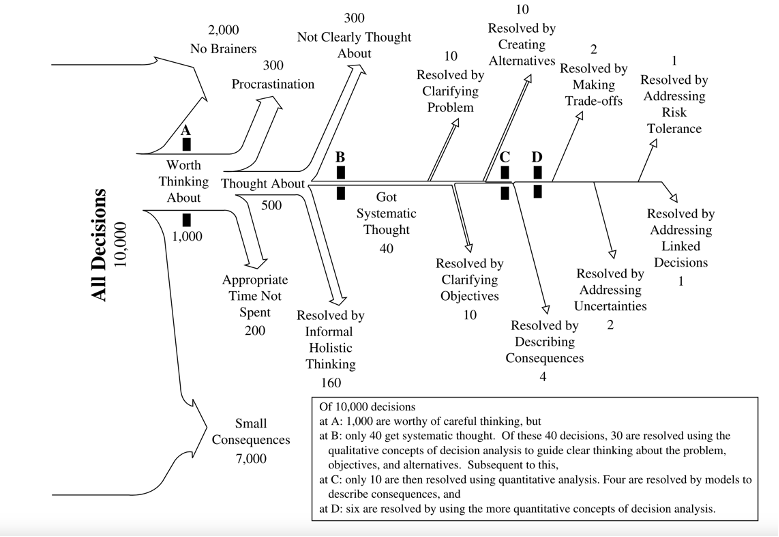
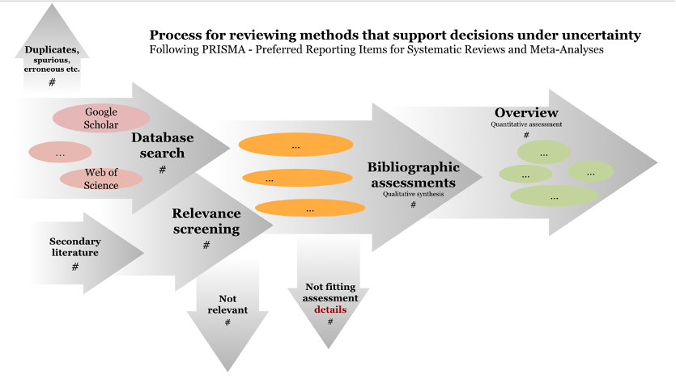

# Introduction

<!-- A. Background and significance of decision making under uncertainty -->
<!-- B. Objectives of the review paper -->
<!-- C. Overview of the decision-making processes -->

Decisions made under uncertainty occur in circumstances where a decision-maker is in the position of choosing between potentially competing options. Such decisions often have to be made with no formal scientific support and often do not need much formal support [@keeneyMakingBetterDecision2004b]. Decision-supporting research can offer formal support by prescribing a recommended course of action. In general, this is done with the assumption that decision-makers seek maximum expected utility. This means we must assume that the decision maker will want the option with the greatest positive outcome according to their stated outcomes of interest. The decision-making processes can be categorized into two levels of decision making: 1) a decision aimed at influencing an outcome where the expected choice is the one which maximizes the desired outcome, based on information currently available to the decision maker and 2) a decision on how to allocate resources to reduce the uncertainty in the previous decision problem, i.e., to increase the current information to improve the likelihood of choosing the option with the most beneficial outcome. 

Such decisions are often made in policy settings like in healthcare, where a choice to fund the health of one part of society often comes at the cost of another, assuming limited budget allocation [@claxtonMethodsEstimationNational2015a]. This choice involves costs, benefits and risks in the form of possible damage and trade-offs in comparison to a baseline and or other decision options. 

Our own work has covered such situations regarding the nutritional costs of agricultural expansion in Uganda [@whitneyProbabilisticDecisionTools2018a], the choice between different siltation management options in Burkina Faso [@lanzanovaImprovingDevelopmentEfficiency2019e], the management of competing water resources in Kenya [@luedelingFreshGroundwaterWajira2015a], and deciding between agroforestry interventions in Vietnam [@doDecisionAnalysisAgroforestry2020g]. In these cases, we apply, adopt and update the classical processes of Decision Analysis [@keeneyFeatureArticleDecision1982b; @jeffreyLogicDecision1990; @howardFoundationsDecisionAnalysis2015a]. To achieve this, we co-generate impact pathways of decisions to provide the structure for a mathematical formula that is then used to estimate the expected utility. We perform a quantitative analysis [@luedelingDecisionSupportQuantitativeSupport2022] of welfare-based decision-making processes using Monte Carlo simulations. In our work, we interpret the welfare-based decision problem as a von Neumann-Morgenstern utility function and apply the ‘Value of Information Analysis’ to assign a value to a certain reduction in uncertainty or, equivalently, increase in information. 

There are a number of ways that decisions made under uncertainty can be supported. Through this review we seek to generate a complete overview of all the applications of similar processes that aim to support decision-making under uncertainty. 
 
We offer an overview of methods that are applied to support decisions under uncertainty. We focus on summarizing the state-of-the-art methods in decisions. We identify, define, and evaluate research by extracting the decision-supporting methods, describing them and their approach to supporting decisions. We present a protocol-driven comprehensive review and synthesis of the various methods applied for decision support. We offer an overview of where these methods are currently applied and some interpretation about where these applications can be expanded. 

# Review and Synthesis

# Protocol-driven approach to reviewing decision support methods

## Methods

## Literature collection

Protocol: We follow the PRISMA (Preferred Reporting Items for Systematic Reviews and Meta-Analyses) (Figure 2). We gather data from the Web of Science Core Collection curated database of published, peer-reviewed and larger and more diverse published articles, preprints, theses, books, and other relevant scientific content in Google Scholar. After much deliberation and discussion amongst the authors, the final search query consisted of the following keywords.

**Decision + Intervention OR policy + Uncertainty + Expert OR stakeholder + Model OR monte carlo OR simulation OR computer assisted + value of information OR information accuracy**

“decision”+(“intervention”OR”policy”)+“uncertainty”+(“expert”OR”stakeholder”)+(“model“OR”monte carlo”OR”simulation”OR”Bayesian”OR”computer assisted”)+
(“value of information”OR”information accuracy”)

From Web of Science, 14 records were collected in May 2023, and from Google Scholar, 17500+ records were collected in April and May 2023. Associated papers and articles from the search records were also gathered as secondary data collection. Some had shared arXiv or doi links, other parts of shared contributions and assorted affiliations that led to new papers. We applied specific inclusion criteria to this large set of records to reduce the number of records covered under this study. An independent screening of the collected records is performed to confirm their eligibility for the study.

### Inclusion criteria: 

1. Record should be in the English language, 
1. Scientific articles, reports and XXX are included,
1. Must involve some form of decision-making or decision-supporting aspect,

### Reasons for exclusion

- Annual reports, syllabus, catalogs of studies, unrelated legal documents, published bibliography collections, duplicates, course notes, preprints (where we already have the published journal article)
- All non-scientific reports and case studies
- ... 

## Methodology extraction

We use Keeney’s representation of where formal decision support is required and applied as motivation and framework for the assessmentKeeney’s judgment about how 10,000 decisions are typically made - his personal histogram of 10,000 decisions being faced by numerous decision makers \@ref(fig:01_keeney) [@keeneyMakingBetterDecision2004b].

We followed the Preferred Reporting Items for Systematic Reviews and Meta-Analyses (PRISMA) \@ref(fig:02_prisma) SystematicReviewOverviewFigure 

<!-- temporary note to the co-author team, this figure is editable at this address https://docs.google.com/presentation/d/1TLnVV3VIgcoUeXoBwmzvjdg-08AEW0mhrmnCHfVXQwY/edit#slide=id.p -->

We preserved our search string on searchRxiv [@whitneyReviewMethodsSupporting2023]

*Google Scholar (GS)* yielded 17,600 results but without an asterisk for decision* and model* it yielded just 17,400 results. This is a bit counter intuitive; the ‘*’ should widen rather than narrow the search. If anything, we should expect the opposite effect and the larger return in the former search. Then these 200 additional results would say something like ‘models’ or ‘decisions’ but not ‘model’ or ‘decision’. These should be kept. 

‘Google Scholar advanced search’ is much less targeted (2.4 million hits): 
with all of the words: decision intervention policy uncertainty model
with at least one of the words: “value of information” ”information accuracy” 
“intervention” ”policy”“model*“ 
”monte carlo” ”simulation” ”Bayesian" “computer assisted” 
”expert” ”stakeholder” 
where my words occur ‘anywhere in the article’

After importing papers to Zotero we: 

-	Run PDF search in Zotero to find about 20 missing PDFs. Manual PDF search for ~300. Look up web pages that report findings to find original publication, proceedings (20), papers (40), thesis (30)
-	Remove lots of spurious things that turned up in the results: Annual reports (5+), syllabus / catalogs of studies (10+), unrelated legal documents (3+), published bibliography collections, duplicates (50+), course notes (2), preprints (where we already have the published journal article 5)
-	Add papers to our collection that appear in the bibliography and syllabus that were not already in the search (40+). Google Scholar suggested these papers because of the citation to relevant work. 

In looking for the PDFs and following up with some of the thesis, notes, syllabi etc. in the Google Scholar returned list we added additional associated papers and articles. Some had shared arXiv or doi links, other parts of shared contributions and assorted affiliations that lead to new papers. Sometimes the class notes and syllabus that were in the scholar search return were there because they listed papers that were relevant to our search terms. These were sometimes already in our main collection and sometimes not. When they were not in our collection, we added them.  

Web of Science - 14 results

CABI - 13 results

Decision +
Intervention OR policy +
Uncertainty + 
Expert OR stakeholder +
Model OR "monte carlo" OR simulation OR "computer assisted" + 
"value of information" OR "information accuracy"

# 02_Decision_Making_Processes

## Summary of the reviewed methods, their approaches and applications
### Maximizing desired outcomes based on available information
### Resource allocation to reduce uncertainty and improve decision outcomes
## Examples of decision-making scenarios in policy settings
## Current applications and potential future expansions

# 03_Decision_Analysis

## Overview of decision analysis
## Co-generating impact pathways for decision structuring
## Estimating expected utility using mathematical formulas
## Quantitative analysis and Monte Carlo simulations

# 04 Holistic Approaches in Decision Support

## Definition and characteristics of holistic approaches
## Applications of holistic approaches in decision-making under uncertainty
## Comparison with classical decision analysis methods

# 05 Overview of Decision Support Methods

## Identification and classification of decision-supporting methods
## Description and evaluation of selected methods
## Applications of decision support methods in various domains

# 06 Value of Information Analysis

## Concept and relevance of the value of information
## Application of the value of information analysis in decision making
## Assessing the impact of uncertainty reduction or information increase

# 07_Conclusion

## References
